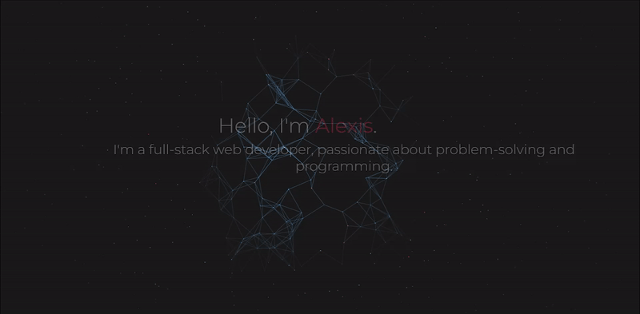

# [Portfolio](https://alexisintech.github.io/)
My personal portfolio includes a small biography about myself, a showcase of notable projects, and my social media links where I can be contacted.

  

## How It's Made:

**Tech used:** HTML, CSS, JavaScript     
Portfolio layout and background credits go towards [Ben Scott](https://benscott.dev/)  
Bio switcher credits go towards [Jason Langstorf](https://www.jason.af/)

## Lessons Learned:

This portfolio has been a continuous journey of practicing media queries, animations and transitions, and most importantly, JavaScript!!! While the JavaScript code was written almost entirely by Ben Scott, delving into it to customize it for my portfolio has been a huge learning process and each week that I progress in my bootcamp, I love looking at this portfolio's JS code and recognizing more and more code. I've truly had a FIELD DAY with the media queries for this project - and I still continue to fix breakpoints whenever I have the time. This project's code isn't the cleanest or the driest, but it's such a constant work in progress that I find myself cleaning up code in my free time, just to emphasize the hard work, dedication, and love I have for this project, and all of my projects.
